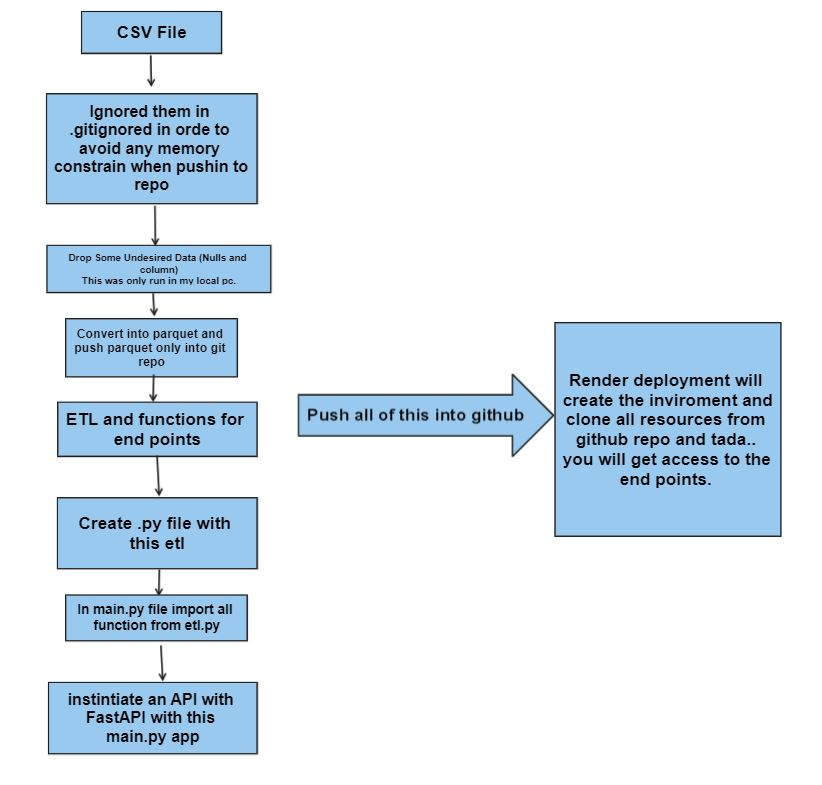
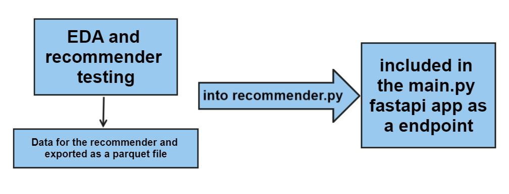

# Well Come to MLOps Individual Project by Juan D

You will find here one of the thousand approaches to deliver a made up bussiness request.

What is that request? 

* Instintiate an API in order to consume data in this form.

* The next end points does not have any text format handling so that you have to pass perfect string writting to them.

* Count the number of movies by language. This end point accept languages iso code, for example: "de" is for german, "fr" for french, and so on...
Here you will find those iso languages code for trying out this end point [iso language codes](https://en.wikipedia.org/wiki/ISO_639-1_codes)

* Run Time and Release Year by movie title

* The collections of that movie title if it exists. For example: Try out to search "The Matrix" or any title of harry potter's movie

* Number of movies produced in a country. This is a good one because it retrieves the number og movies produced in the provided country. For example in Mexico a few movies has been produced in thatr lands eventhough they are not created by Mexican producers.

* The company success retrieves the information such as the name itself, total revenue, and number of movies produced. Try  inputting "Pixar Animation Studios" out.. or any other movie producer movies like Warner.

* Director Success. this one will give you all movies produced by the given director Name, for example Alfonso Cuaron.. I did not know this director has been a one of the directors of harry potter's saga. Even I did not know that those movies have multiple directors.

 * Finally you will see the recomender. This is a simple lightwieght recommendation model. It only uses 2000 records out of the almos 45k records of the original csv file. This is because if the dataframe may include the hole sataset, a very large array of cosine similatiries would take 14 gb of ram. Tha's wild. 

# My approach

The architecture that I follow is completelly towards functionality and effitiency. For the API you will find the etl.ipynb file with all functionalities taken for getting simple csv file into an end points. How was that can be get done?

The file .ipynb was used to run tests, and .py is the application. 

And this is the deployment url

### IMPORTTANT! 

Please wait a couple minutes for running the application ar render (about 5 to 6 minutes ;)) 

[render deployment](https://demo-1-henry-pi.onrender.com/docs#/)

# The EDA process

Here I focused on outliers and of they could cause an effect on statisstics. You will see some transformation here also in spite of the previous ETL proccess.. but recall this, the ETL proccess was to delivery end points.. and some significant data was dropped in order to fit this into the memory contraint render enviroment (512mb and 0.5 cpu capability). 

Here is cinluded also the recommendation model. later that code is exported into a .py file

### About the recommender model

This modeln was built upon 2000 records out of the 4k of the dataframe in order to fit this into render. So please try this demo out by inputting Toy Story frist and you will see it works. The prediction performance maybe is not that great.

All this job you can see it in the eda.ipynb file and recommender.py file.

### An brief explanation about this repo

Please [click here for the youtube video](https://www.youtube.com/watch?v=ncztSfACVHM)